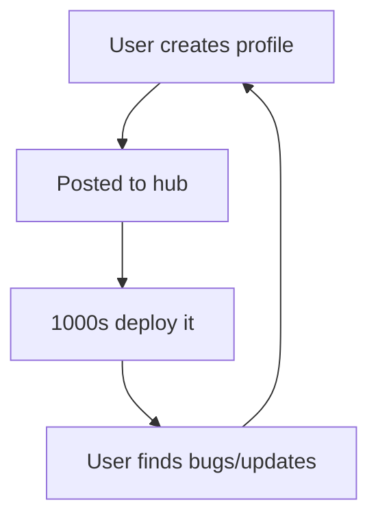
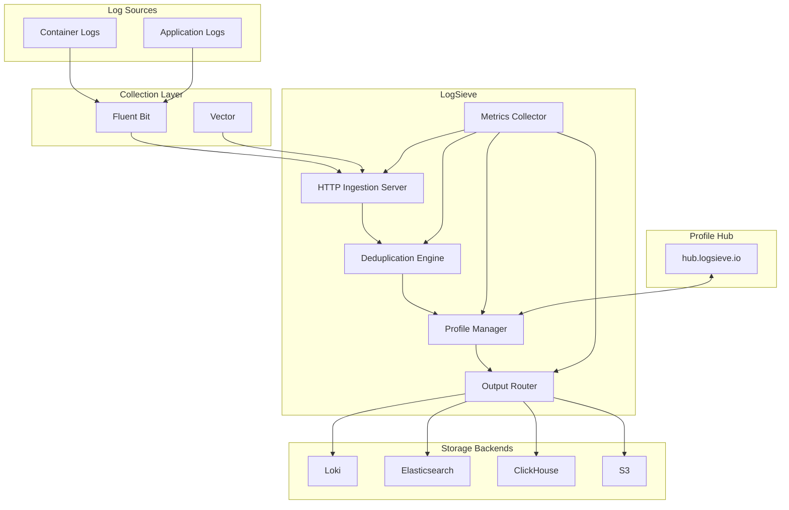

# LogSieve: The Original Vision

This document captures the original dream and vision for LogSieve as conceived in the initial implementation plan.

## The Core Insight

Modern applications generate **terabytes** of near-identical logs: duplicate stack traces, healthcheck spam, and heartbeat noise. Storage costs explode while signal drowns in noise.

The breakthrough insight: **Community-powered log reduction through shared profiles.**

## The Vision: "Plug into the log-reduction graph"

Instead of everyone writing their own regex filters for nginx, postgres, java-spring, etc., we create a **network effect**:

1. Someone creates a profile for `postgres-cnpg` → shares it publicly
2. **You drop the sidecar into your cluster** 
3. Log volume drops 90% – *zero new config required*

## The Flywheel Effect



**The magic:** You benefit immediately from others' work, and your improvements help everyone.

## Original Architecture Vision



## Key Differentiators

### 🚀 Community Profile Hub
- **Find profiles:** `hub.logsieve.io/profiles?image=postgres-cnpg:v1.2`
- **Share profiles:** Submit your YAML via PR → all users benefit
- **Auto-update:** Profiles versioned by image SHA

### ⚡ Fluent Bit Native
```conf
[OUTPUT]
  Name          http
  Host          logsieve
  Port          8080
  URI           /ingest?profile=auto
  Format        json
```

### 🧠 Smart Reduction Engines
- **Drain3 templating:** Cluster identical lines in real-time
- **Context windows:** Keep ±N lines around first error occurrence
- **Cost metering:** `logsieve_dropped_bytes_total` shows savings

## The Dream User Experience

### For PostgreSQL CNPG Stack

1. Fluent Bit tails container logs
2. Sends batches to LogSieve via HTTP
3. LogSieve loads `postgres-cnpg.yaml` from profile hub
4. Drain3 fingerprints/templates identical lines
5. Only unique events + critical context shipped

*No YAML editing. No regex hell.*

### 5-Minute Setup

```bash
helm repo add logsieve https://logsieve.github.io/charts
helm install my-sieve logsieve/logsieve \
  --set fluentbit.enabled=true \
  --set profileHub.autoImport=true
```

*Auto-injects sidecar + loads profiles for nginx, postgres, java-spring, etc.*

## Original Performance Targets

- **Throughput**: 10,000 logs/second per instance
- **Latency**: <10ms p99
- **Memory**: <100MB baseline, <500MB under load
- **CPU**: <0.5 cores baseline, <2 cores under load
- **Dedup Ratio**: >85% for typical workloads

## The Community Vision

### Profile Creation Flow

1. **Record logs:**
```bash
logsieve capture --app=your-app > sample.log
```

2. **Generate profile:**
```bash
logsieve learn -i sample.log -o your-app.yaml
```

3. **Submit to hub:**
```yaml
apiVersion: hub.logsieve.io/v1
kind: LogProfile
metadata:
  name: bitnami-postgres-15
  image: docker.io/bitnami/postgresql:15.*
  author: @yourgithub
spec:
  fingerprints:
    - pattern: "ERROR:  duplicate key .*"
      scrub: ["Key (.*)=exists"] 
```

### Success Metrics (Original Dream)

**Adoption:**
- 1,000 GitHub stars in 6 months
- 50 community profiles
- 10 major users

**Technical:**
- 90% log reduction average
- <1% performance overhead
- 99.9% uptime

**Community:**
- 100 contributors
- 500 Slack members
- Monthly community calls

## The Roadmap Vision

- **Q3 2024:** Profile Hub Web UI (search, preview, diff)
- **Q4 2024:** SaaS LLM summaries for unknown patterns ($0.15/GB)
- **2025:** Integrated Fluent Bit build (single binary)

## Why This Could Work

### The Network Effect
Every profile shared makes the system more valuable for everyone. Unlike traditional tools where you're on your own, LogSieve gets better as more people use it.

### Immediate Value
You don't need to wait for network effects - even the first user gets value from built-in profiles for common stacks.

### Sustainable Growth
The community maintains profiles because they benefit from others' work. It's not charity - it's enlightened self-interest.

## The Original Tagline

**"Plug into the log-reduction graph: slash container log volumes by 90% with community-powered profiles."**

*A sidecar that dedupes, filters, and routes logs before they hit Loki, Elasticsearch, or ClickHouse – powered by shared profiles for your exact stack.*

---

This was the original dream - a community-powered solution to the universal problem of log noise, built on the insight that most applications generate similar patterns that can be shared and reused across organizations.