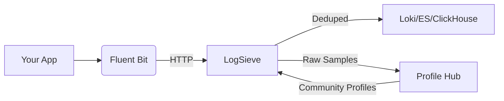
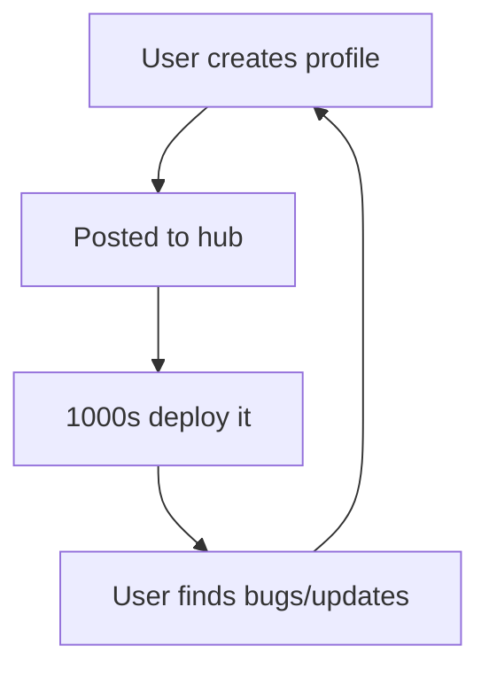

# LogSieve

**Plug into the log-reduction graph: slash container log volumes by 90% with community-powered profiles.**

*A sidecar that dedupes, filters, and routes logs before they hit Loki, Elasticsearch, or ClickHouse – powered by shared profiles for your exact stack.*

---

## 1. Why LogSieve?

Modern apps vomit **terabytes** of near-identical logs: duplicate stack traces, healthcheck spam, and heartbeat noise. Storage costs explode while signal drowns.

Existing solutions fail you:

* ❌ Hand-crafted regexes that break on new releases
* ❌ Siloed tools (Loki filters, Drain3, Fluent Bit) that solve only half the problem
* ❌ No shared knowledge for common stacks

LogSieve fixes this with **community-config**:

1. Someone creates a profile for `postgres-cnpg` → shares it publicly
2. **You drop the sidecar into your cluster**
3. Log volume drops 90% – *zero new config required*

---

## 2. How It Works (Fluent Bit First!)



### For Your PostgreSQL CNPG Stack

1. Fluent Bit tails container logs
2. Sends batches to LogSieve via HTTP
3. LogSieve loads `postgres-cnpg.yaml` from profile hub
4. Drain3 fingerprints/templates identical lines
5. Only unique events + critical context shipped

*No YAML editing. No regex hell.*

---

## 3. Key Features

### 🚀 Community Profile Hub

* **Find profiles:** `hub.logsieve.io/profiles?image=postgres-cnpg:v1.2`
* **Share profiles:** Submit your YAML via PR → all users benefit
* **Auto-update:** Profiles versioned by image SHA

### ⚡ Fluent Bit Native

```conf
[OUTPUT]
  Name          http
  Host          logsieve
  Port          8080
  URI           /ingest?profile=auto
  Format        json
```

*(Works with Vector/Loki too)*

### 🧠 Smart Reduction Engines

* **Official Drain3 implementation:** Full spec compliance with proper clustering, template generalization, and parameter extraction
* **Context windows:** Keep ±N lines around first error occurrence
* **Advanced output support:** Loki v3+ structured metadata, ECS-compliant Elasticsearch, Prometheus best practices
* **Cost metering:** `logsieve_dropped_bytes_total` shows savings

### 🔌 Output Flexibility

Loki, Elasticsearch, ClickHouse, S3, or stdout.

---

## 4. Get Started in 5 Minutes

### Kubernetes (Fluent Bit + Helm)

```bash
helm repo add logsieve https://logsieve.github.io/charts
helm install my-sieve logsieve/logsieve \
  --set fluentbit.enabled=true \
  --set profileHub.autoImport=true
```

*Auto-injects sidecar + loads profiles for nginx, postgres, java-spring, etc.*

### Docker Compose

```yaml
services:
  app:
    image: yourcorp/postgres-cnpg:v1.2
  fluentbit:
    image: cr.fluentbit.io/fluent/fluent-bit
    config: |
      [INPUT]
        Name tail
        Path /var/log/containers/*.log
      
      [OUTPUT]
        Name http
        Match *
        Host logsieve
        Port 8080
        URI /ingest?profile=postgres-cnpg

  logsieve:
    image: logsieve/sieve:latest
    command: --hub-sync hourly
```

---

## 5. How Profiles Work (For Contributors)

### Find/Use Existing Profiles

```bash
# List all PostgreSQL profiles
curl hub.logsieve.io/v1/profiles?app=postgres

# Run with profile
docker run logsieve/sieve --profile=hub/bitnami-postgres-15
```

### Create/Share New Profiles

1. Record logs:

```bash
logsieve capture --app=your-app > sample.log
```

2. Generate profile:

```bash
logsieve learn -i sample.log -o your-app.yaml
```

3. Submit to hub:

```yaml
apiVersion: hub.logsieve.io/v1
kind: LogProfile
metadata:
  name: bitnami-postgres-15
  image: docker.io/bitnami/postgresql:15.*
  author: @yourgithub
spec:
  fingerprints:
    - pattern: "ERROR:  duplicate key .*"
      scrub: ["Key (.*)=exists"] 
  # ... (full spec same as before)
```

*All profiles require 30MB test samples for CI validation.*

---

## 6. Built-In Observability

### Critical Metrics

| Metric                          | Description               | Alert Threshold              |
| ------------------------------- | ------------------------- | ---------------------------- |
| `logsieve_dedup_ratio`          | % of lines deduped        | < 0.85                       |
| `logsieve_ingestion_logs_total` | Total logs processed      | Rate monitoring              |
| `logsieve_output_errors_total`  | Output delivery failures  | > 10/min                     |
| `logsieve_bytes_dropped_total`  | Storage \$ saved          | *Grafana dashboard included* |
| `logsieve_drain3_clusters_total`| Active log templates      | Growth monitoring            |

### Profile Health Checks

```bash
# Scan profile against live logs
logsieve audit --profile=hub/your-app --live
```

> ✅ Profile hub/your-app: 98.2% coverage
> ⚠️ 12 new patterns detected (saved to /tmp/unknown.log)

---

## 7. Roadmap

* **Q3 2024:** Profile Hub Web UI (search, preview, diff)
* **Q4 2024:** SaaS LLM summaries for unknown patterns (\$0.15/GB)
* **2025:** Integrated Fluent Bit build (single binary)

*Windows containers and ClickHouse output are community-driven efforts.*

---

## 8. Why This Works

### The Flywheel Effect



**You benefit immediately:**

1. CNPG user shares `postgres-cnpg.yaml`
2. Your installation auto-downloads it
3. Your Loki bill drops 89% next month

---

## 9. Start Saving

```bash
# Try it with your PostgreSQL logs
docker run --rm logsieve/sieve \
  --source fluentbit \
  --profile hub/bitnami-postgres-15 \
  --output loki://your-loki:3100
```

**Join the log-reduction graph:**
➡️ [hub.logsieve.io](https://hub.logsieve.io) | [📚 Docs](https://logsieve.io/docs) | [💬 Slack](https://slack.logsieve.io)

*“Finally stopped paying for logging junk”* – Early user, 34TB/month reduction

